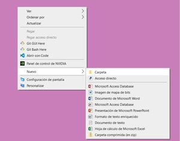

# Gestión del repositorio para la correcta realización del Reto 2.

## Descripción
A continuación, procedo a detallar la manera en la que automatizamos el proceso de gestión de un repositorio con las distintas acciones que nos proporciona GitHub. De esta manera podremos ahorrar tiempo y minimizar errores al ejectuar distintas tareas.

## Paso 1: Creación del Repositorio y subida de carpetas/documentos
Lo primero que necesitamos hacer es crear un repositorio en GitHub donde iremos gestionando los distintos archivos. Esto lo podremos hacer a través de la pestaña "New" en nuestro perfil. Una vez que tenemos nuestro repositorio configurado, subimos la carpeta específica que nos han solicitado. Esta carpeta contiene un proyecto de Java.

## Paso 2: Creación de una nueva rama
GitHub nos da la posibilidad de tener distintas ramas sobre las que trabajar. Esto facilita el desarrollo del proyecto cuando se trata de un equipo de trabajo. Así cada uno puede gestionar la tarea que se le ha otorgado sin interrumpir o pisar el trabajo de otro compañero de equipo. En nuestro caso, creamos la rama **desarrolloPersona**.

## Paso 3: Descarga del contenido de esta nueva rama en un repositorio local
Necesitamos clonar la información/documentación para poder trabajar sobre ella por lo que sería nuestro primer paso.

## Paso 4: Modificación, actualización y comprobación
Ahora que ya tenemos el acceso a la documentación, podemos realizar las gestiones que nos hayan solicitado que hagamos. Cada vez que realicemos algún cambio, podremos actualizar y comprobar los mismos a través del histórico que nos proporciona GitHub. Será en este punto donde aprovechemos para crear una nueva clase dentro del proyecto de Java.

## Paso 5: Fusión de las ramas
Una vez que hemos finalizado nuestra tarea y se haya comprobado que todo sea correcto, **debemos fusionar** la rama de trabajo que hemos creado con la principal. Así todos dispondremos de acceso a los nuevos cambios realizados.

## Último paso: Presentación
Una vez comprobado que los pasos a seguir son correctos, se crea una presentación. De esta manera, disponemos de una guía básica con los pasos a seguir para la realización del Reto 2.

